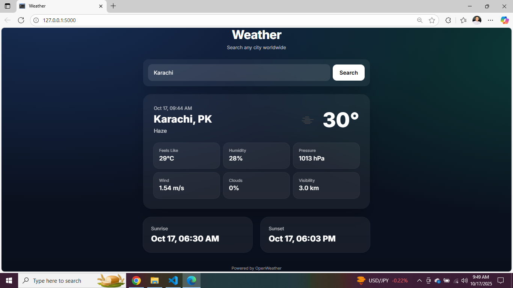
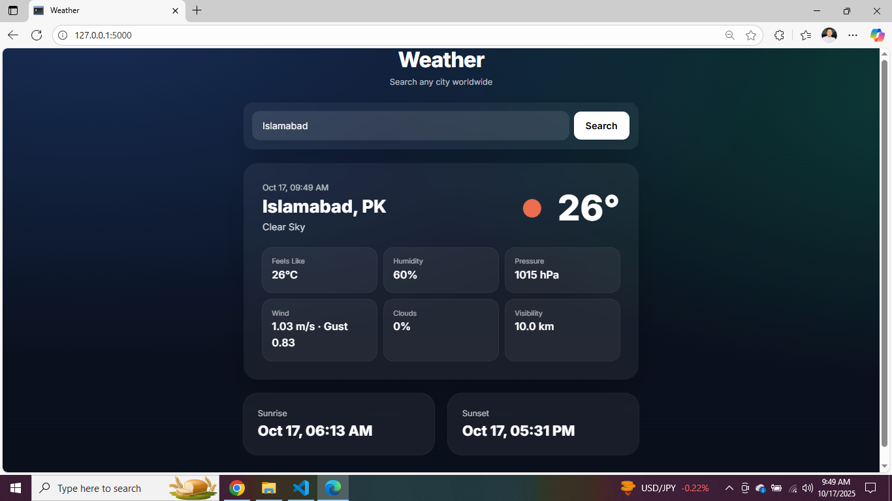

# 🌦️ Weather Web Application

A simple **Weather Web App** built using **Flask**, **HTML**, and **CSS**, with **API handling** to fetch real-time weather data.

---

## 🚀 Features
- 🌍 Search for weather by **city name**
- 📡 Fetches live data using an external **Weather API**
- 🎨 Clean and responsive **UI** with HTML & CSS
- 🧠 Built with **Flask (Python)** as the backend framework

---

## 🧰 Technologies Used
- **Python** (Flask)
- **HTML5** & **CSS3**
- **Weather API** (via `requests` library)
- **Environment Variables** for API key security (`.env` file)

---

## 🖼️ Screenshots

### 🏠 Home Page


### ✅ Weather Check Page


---

## ⚙️ How It Works
1. The user enters a **city name**.
2. Flask sends a **request** to the Weather API.
3. The API returns real-time data (temperature, humidity, description, etc.).
4. Flask dynamically renders the result using an HTML template.

---

## 💡 Setup Instructions

### 1️⃣ Clone the Repository
```bash
git clone https://github.com/yourusername/Weather-Application.git
cd Weather-Application
